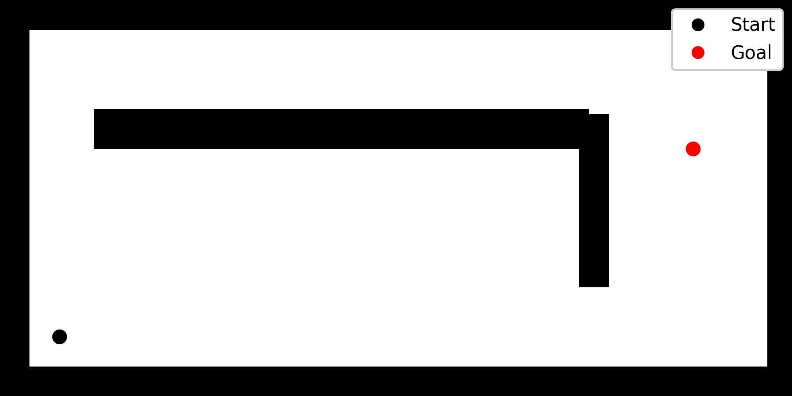
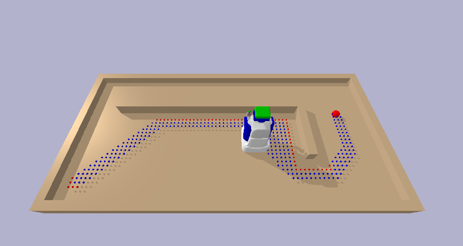
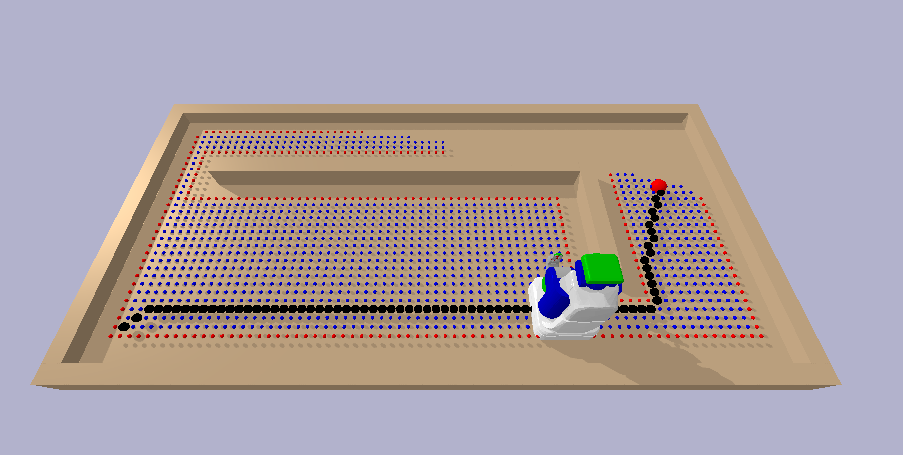

# Grid-Based Path Planning

> **Note:** This repository contains a brief project summary and selected visual results only. To respect course policies, I am not publishing the code, project writeup, complete experimental design, or quantitative results.

## Overview

This course final project explored search-based path planning for a mobile robot on a discretized SE(2) grid. I implemented A* and its anytime variant in PyBullet using a PR2 mobile platform with geometry-based collision checking. The project focused on how heuristic choices and environment structure influenced planner behavior across occlusion, narrow-passage, and dead-end scenarios.

## Simulation Setup

- PyBullet simulation with a PR2 mobile platform
- Discretized SE(2) configuration space
- Collision checking during planning
- Test non-trivial environments designed to expose misleading paths and recovery behavior

## Key Takeaways

- Heuristic design strongly affected search efficiency and recovery behavior.
- The anytime variant found suboptimal, feasible paths earlier, but had longer convergence times and brouder exploration for the optimal solution.
- Planner performance depended heavily on environment structure, especially in misleading layouts where the robot could become trapped. The usefulness of an anytime variant ultimately depended on the nature and risk tolerance of the planning problem, including time constraints, safety considerations, and whether a feasible solution was acceptable before an optimal one.

## Learning Outcomes

This project helped me develop a stronger foundation in search-based optimization, discretized configuration-space planning, and heuristic design. More importantly, it showed how planner performance depends not only on the algorithm itself, but also on environment structure and the tradeoffs between solution quality and time constraints.

## Example Scene

One test environment used an occlusion that blocked the direct route to the goal. This scene was useful for comparing how both planners explored around obstacles and how quickly the anytime variant produced an initial feasible path before improving it.

## Example Planning Result

Below are examples of the planned paths for the anytime variant in the occlusion environment. In this case, the anytime variant was able to find a suboptimal, feasible path earlier, while continued search improved the solution over time.

